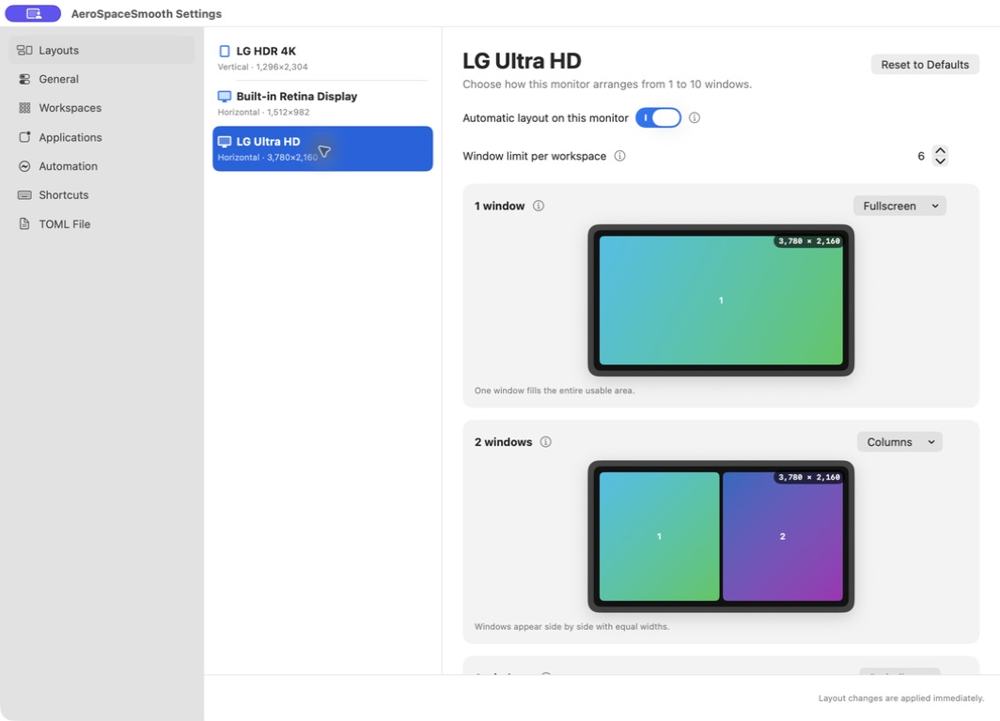
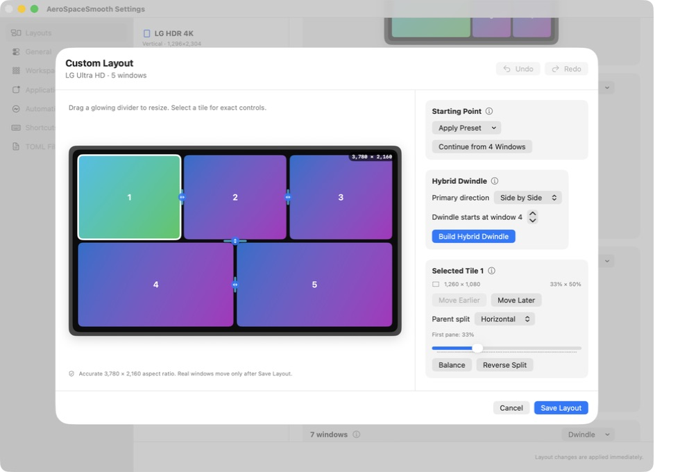
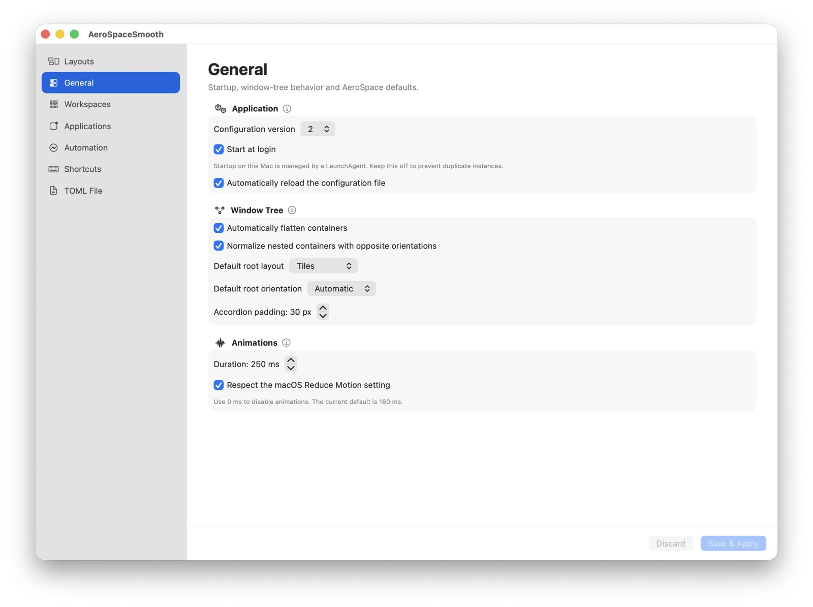

# AeroSpaceSmooth feature and Settings guide

AeroSpaceSmooth started as an effort to make a Mac behave more like an
Omarchy/Hyprland workstation without giving up the parts of macOS that are useful
day to day. The goal is fast keyboard navigation, predictable workspaces on each
monitor, Dwindle-style layouts, a visible focused window, and smooth movement —
with a Settings window that makes the system understandable without requiring
every user to hand-edit TOML.

This document describes the changes currently present in the fork, how they work,
and which parts still belong to the user's local setup.

## Relationship to AeroSpace

AeroSpaceSmooth is a GitHub fork of
[nikitabobko/AeroSpace](https://github.com/nikitabobko/AeroSpace). The upstream
project supplies the window tree, tiling engine, workspace emulation, command-line
interface, hotkey system, Accessibility integration, and TOML configuration model.

The fork retains that foundation and adds an opinionated visual layer and automatic
layout coordinator. It is not affiliated with or supported by the upstream author.
Upstream documentation remains the authoritative reference for standard AeroSpace
commands and configuration semantics.

New features in this fork are implemented independently against the existing
AeroSpace interfaces and publicly described behavior. No source code from other
window-manager projects is incorporated.

## Main design goals

The work in this fork follows these principles:

1. **The monitor is the unit of layout configuration.** A wide external display,
   a portrait display, and a MacBook screen should not be forced to use the same
   sequence of layouts.
2. **The number of windows selects the layout.** One window can fill the screen,
   two can use columns, and larger counts can progressively switch to Dwindle,
   Grid, Vertical Pairs, or a custom tree.
3. **The primary window should be easy to identify and use.** Wide-screen Dwindle
   starts with the large primary pane on the left; portrait-oriented profiles can
   use stacked or paired arrangements.
4. **Window changes should feel coordinated.** Opening, closing, moving, and
   rebalancing windows should animate as one reflow instead of a sequence of
   unrelated jumps.
5. **Manual intent must be respected.** A deliberate `join-with` operation should
   not be immediately overwritten by automatic Dwindle reconciliation.
6. **Configuration should remain transparent.** The GUI edits the normal TOML file,
   preserves comments and unrelated keys, and shows the exact result before saving.
7. **Advanced users can still use the CLI and TOML.** The Settings window is an
   additional interface, not a replacement for the original AeroSpace model.

## Delivered development workstreams

The current branch was built incrementally rather than as one isolated UI patch:

| Workstream | Result |
| --- | --- |
| Visual configuration foundation | Native Settings shell, editable TOML model, comment-preserving patches, validation, and save/reload flow. |
| Per-monitor layout profiles | Independent enablement, window limit, and 1–10 window layout sequence for each detected display. |
| Manual per-count mode | Custom becomes a first-class selection that can preserve a user-designed topology. |
| Smooth layout transactions | Coordinated frame animation, replacement of obsolete animations, and protection against event feedback loops. |
| Custom layout editor | Presets, continued layouts, Hybrid Dwindle, ordering, split direction, balance, reverse, and saved blueprints. |
| Direct manipulation | Real monitor aspect ratios, draggable dividers, exact pixel/percentage feedback, and undo/redo. |
| Workspace resilience | Reconciliation of malformed trees, monitor reconnect profile persistence, and safer hidden-workspace positioning. |
| Constraint handling | Selected Dwindle/Custom topology remains authoritative even when an application has a large minimum size. |
| Manual grouping | Service-mode `join-with` edits survive normalization and automatic reconciliation until membership changes. |
| Everyday workspace tools | UUID-backed monitor profiles, monitor-relative slots, multi-window scratchpads, manual tree restoration, and a clickable workspace bar. |
| Visual navigation | Searchable Overview and Command Palette, exposed through the menu and bindable CLI commands. |
| Operational safety | Detection of competing window managers and daily checks for public releases without automatic installation. |

## Opening Settings

Start AeroSpaceSmooth and click its menu-bar icon, then choose **Settings…**.
The window title is **AeroSpaceSmooth Settings**.

Development builds can also open Settings immediately at launch:

```sh
open -a AeroSpaceSmooth --args --open-settings
```

The app needs macOS Accessibility permission before it can manage windows. Avoid
running official AeroSpace and AeroSpaceSmooth at the same time: two window managers
reacting to the same Accessibility events can cause repeated moves or apparent loops.

The Settings sidebar contains seven pages:

- Layouts
- General
- Workspaces
- Applications
- Automation
- Shortcuts
- TOML File

Each settings card includes an information button. Clicking the small `i` explains
what that group controls and the consequences of changing it.

### Settings gallery

The Layouts page adapts its visual previews to the selected monitor:



Custom layouts are edited directly on an accurately proportioned display preview:



Standard AeroSpace behavior and AeroSpaceSmooth animation controls live together on
the General page:



## Layouts

Layouts is the main AeroSpaceSmooth-specific page. It detects the currently connected
monitors and gives each monitor an independent profile. A profile is stored by the
Core Graphics display UUID, so a localized display-name change or screen reordering
does not reset its layout choices. Existing name-based profiles migrate automatically.

The monitor list shows:

- The macOS display name.
- Whether the display is horizontal or vertical.
- The display's logical width and height.

Selecting a monitor opens its editor.

### Automatic layout

**Automatic layout on this monitor** enables the AeroSpaceSmooth coordinator for
that display. When enabled, the coordinator examines the number of tiled windows in
each workspace and applies the layout configured for that exact count.

Disable it to use standard AeroSpace tree behavior on that monitor.

### Window limit per workspace

Every monitor has its own **Window limit per workspace** from 1 through 10. If a
workspace exceeds the limit, overflow windows are moved to another workspace assigned
to that same monitor that still has capacity.

The default is 5 for the built-in MacBook display and 6 for other displays. These are
only defaults; each monitor can be changed independently.

This setting is important when troubleshooting grouping or movement. Two windows can
only share a node when they are in the same AeroSpace workspace. If moving a window
into a full workspace exceeds the monitor's limit, the coordinator may route it to a
different workspace.

### Layout per window count

The page contains a card for every count from 1 through 10. A selection affects only:

- The selected monitor.
- The exact number of tiled windows shown by that card.

For example, choosing Columns for 2 windows and Dwindle for 3 windows means closing
the third window automatically returns the workspace to Columns.

The available styles are:

| Style | Behavior |
| --- | --- |
| Fullscreen | One tiled window fills the monitor's usable area. |
| Columns | All windows appear side by side with equal widths. |
| Rows | All windows are stacked with equal heights. |
| Dwindle | The first window gets the primary pane and the remaining region alternates horizontal and vertical splits. |
| Vertical Pairs | Windows are arranged in stacked rows containing up to two windows each. |
| Grid | Window count and monitor orientation determine a balanced row/column grid. |
| Custom | Uses the visual split tree saved for this monitor and window count. |

One-window layouts are always treated specially so a single tiled window can fill the
usable area. On a new horizontal profile, the defaults are Fullscreen for 1 window,
Columns for 2, and Dwindle afterward. On a new vertical profile, the defaults are
Fullscreen, Rows, and then Vertical Pairs.

Layout changes on this page are applied immediately.

### Accurate monitor previews

Every layout card is drawn inside a monitor frame using the connected display's actual
logical aspect ratio. A portrait screen therefore has a portrait preview instead of a
generic landscape rectangle. The preview also displays the logical resolution used for
the calculation.

Tile numbers describe window order. Tile 1 is the primary window in Dwindle and the
first slot in Custom layouts.

## Custom Layout editor

Select **Custom** for a window count and choose **Edit Custom Layout**. The editor uses
the selected monitor's real aspect ratio and keeps changes in a draft until **Save
Layout** is pressed.

### Starting from a preset

**Apply Preset** can replace the draft with:

- Dwindle
- Columns
- Rows
- Vertical Pairs
- Grid

When a layout exists for the previous window count, **Continue from N Windows** copies
that layout and splits the selected tile to make room for the new window. This makes it
possible to build a coherent sequence instead of recreating every count from scratch.

### Hybrid Dwindle

For three or more windows, Hybrid Dwindle keeps the first windows in a straight primary
split and begins alternating Dwindle splits only at a chosen window number.

Controls include:

- **Primary direction:** side by side or stacked.
- **Dwindle starts at window:** selects the transition point.
- **Build Hybrid Dwindle:** generates the new split tree.

This supports layouts such as two predictable working panes followed by a Dwindle tail
for secondary windows.

### Direct resizing

Glowing dividers in the monitor preview can be dragged directly. The editor constrains
split ratios to a usable range so a tile cannot accidentally become effectively zero
width or height.

Selecting a tile shows:

- Its approximate pixel dimensions on that monitor.
- Its width and height as percentages.
- **Move Earlier** and **Move Later** controls for window order.
- The immediate parent split's horizontal or vertical axis.
- An exact ratio slider.
- **Balance** to return the split to 50/50.
- **Reverse Split** to exchange the two sides of that split.

Undo and Redo cover presets, ordering, axis changes, ratio changes, reverse operations,
and interactive divider drags. The editor keeps up to 100 undo steps for the draft.

## General

General exposes application and window-tree behavior that would otherwise live only in
TOML.

### Application

- Configuration schema version.
- Start at login.
- Automatic TOML reload after external edits.

If startup is managed by an external LaunchAgent, leave **Start at login** disabled to
avoid two instances.

### Window Tree

- Automatic flattening of redundant containers.
- Opposite-orientation normalization for nested containers.
- Default root layout: Tiles or Accordion.
- Default root orientation: Automatic, Horizontal, or Vertical.
- Accordion padding.

### Animations

- Coordinated layout duration from 0 through 1000 ms.
- Respect for the macOS **Reduce Motion** Accessibility preference.

Set the duration to 0 to disable animations. The built-in default is 160 ms.

The animation coordinator cancels obsolete work when a newer layout transaction
arrives. It also avoids treating its own intermediate Accessibility events as a reason
to restart the same movement indefinitely.

When an application repeatedly accepts the requested position but rejects the same
requested size, the coordinator verifies the mismatch and records that constraint.
Later layouts stop resending that ineffective size while continuing to move the window,
which prevents shaking and repeated Accessibility traffic.

### Window-manager conflicts, updates, and workspace bar

At startup AeroSpaceSmooth checks for other known window managers, including another
AeroSpaceSmooth instance, AeroSpace, OmniWM, Amethyst, and yabai. Settings also shows
the live conflict state. The user can deliberately continue, but the default warning
helps prevent two processes from fighting over the same windows.

The Updates card can check this fork's latest public GitHub release once per day or on
demand. It only reports availability and opens the release page; it never downloads or
installs software automatically.

The optional Workspace Bar creates a compact clickable strip on every connected display.
It marks the active workspace, can include or hide empty workspaces, and remains visible
across macOS Spaces.

## Workspaces

### Persistent Workspaces

Persistent workspace names remain available even when empty. This keeps keyboard
navigation and monitor ownership predictable.

### Monitor-relative slots

Each UUID-backed monitor profile has ten optional workspace slots. The commands
`workspace monitor N` and `move-node-to-workspace monitor N` resolve the same shortcut
through the currently focused monitor. Empty mappings fall back to the monitor's
workspaces in natural order.

### Scratchpads and manual layout restoration

Ten scratchpad slots can each hold multiple floating windows. In Settings, choose
**Capture Next Window…** and then click the desired window. The slot lists every captured
application and title, reports whether it is visible or hidden, and allows individual
removal. Removing a hidden window returns it to the current workspace instead of leaving
it stranded in the private backing workspace. **Show** and **Hide** move the complete
slot over the current workspace or back to its hidden workspace. Automation and visual app rules can still use
`scratchpad assign N` and `scratchpad toggle N`.

The backing workspaces whose names start with `_smooth-` are private implementation
details. They never become the active workspace and are excluded from the menu bar,
Workspace Bar, Overview, relative navigation, and `list-workspaces` output.

When automatic layout is disabled for a monitor, AeroSpaceSmooth records the tiling
tree's groups, orientations, order, and weights. On relaunch it restores a saved tree
only when the same workspace, display UUID, and complete set of windows can be matched,
so a partial startup cannot overwrite the user's current arrangement.

### Workspace Monitor Assignment

Each workspace can have an ordered list of preferred monitor names. The first connected
match is used. A generic fallback such as `main` can keep workspaces reachable when an
external display is disconnected.

An Omarchy-inspired three-monitor setup can, for example, reserve:

- Workspaces 1–2 for the MacBook display.
- Workspaces 3–7 for a wide external display.
- The remaining workspaces for a portrait display.

These exact numbers and monitor names are user configuration, not hard-coded defaults.

### Gaps

Configure horizontal and vertical inner gaps plus independent outer gaps for the left,
bottom, top, and right edges.

## Applications

The Applications page includes a visual application picker for choosing whether new
windows from a particular application open as **Floating** or **Tiled**. A visual rule
can also match a title substring, route to a workspace, assign a scratchpad, and be
reordered to control priority. The picker
discovers installed and currently running apps, displays their names and icons, and
stores the bundle identifier automatically. **Choose Other…** can select an `.app`
bundle that was not discovered.

These choices are written as standard `on-window-detected` rules, so the resulting
TOML remains compatible with AeroSpace and can still be edited by hand. New rules
continue evaluating later callbacks, allowing an application layout choice to coexist
with an advanced rule such as moving the same window to a workspace. Existing windows
must be reopened after saving for a new detection rule to take effect.

The Advanced Window Detection Rules card retains raw conditions and command lists for
cases that are not representable by the visual editor.

Avoid using application identity as a substitute for workspace ownership unless that is
intentional. A broad rule can make the same browser window appear to jump monitors when
the app is rediscovered.

## Automation

Automation exposes:

- Environment variable inheritance.
- Custom environment variables for commands run by AeroSpace.
- Commands run after login.
- Commands run after startup.
- Commands run when the focused monitor changes.
- Commands run whenever focus changes.

Focus-change callbacks can run frequently, so they should remain fast and should not
continually reassign workspaces or monitors.

## Shortcuts

The Shortcuts page edits both normal **Main Mode** bindings and temporary **Service
Mode** bindings. Each shortcut may run one command or a command chain.

The visual editor writes the normal AeroSpace key notation. In TOML, `alt` corresponds
to the macOS Option key.

The Quick Tools card and menu-bar menu open two native navigation surfaces:

- `overview` searches monitors, workspaces, applications, and window titles; selecting
  a card focuses the target.
- `command-palette` searches common layout, focus, move, workspace, scratchpad, reload,
  and enable actions.

Both names are regular AeroSpaceSmooth commands and can be entered directly in the
visual shortcut editor, for example `alt-space = 'command-palette'`.

### Example Omarchy-style bindings

The following is an example, not a hard-coded fork default:

```toml
[mode.main.binding]
alt-h = 'focus left'
alt-j = 'focus down'
alt-k = 'focus up'
alt-l = 'focus right'
alt-slash = 'layout tiles horizontal vertical'
alt-comma = 'layout accordion horizontal vertical'
alt-shift-semicolon = 'mode service'

[mode.service.binding]
esc = ['reload-config', 'mode main']
h = ['join-with left', 'mode main']
j = ['join-with down', 'mode main']
k = ['join-with up', 'mode main']
l = ['join-with right', 'mode main']
left = ['join-with left', 'mode main']
down = ['join-with down', 'mode main']
up = ['join-with up', 'mode main']
right = ['join-with right', 'mode main']
```

To group the focused window with the node on its left:

1. Press and release `Option+Shift+;` to enter Service Mode.
2. Press only `Left Arrow` or `H`.
3. The command runs and returns to Main Mode.

Do not keep Option and Shift held for the second key. Both windows must belong to the
same AeroSpace workspace. `join-with` groups tree nodes; it does not create native
macOS tabs.

AeroSpaceSmooth preserves a successful manual grouping through the subsequent tree
normalization and automatic-layout pass. The grouping remains stable while workspace
window membership is unchanged. Opening, closing, or moving a window changes the count,
so the configured layout for the new count becomes authoritative again.

Caps Lock can be mapped to Option or a Hyper key with an external tool such as
Karabiner-Elements. That remapping is not part of this repository.

## TOML File

The TOML page shows the active configuration path and provides:

- **Open in Editor** for direct manual editing.
- **Reload from Disk** to discard the visual draft and read external changes.
- A comment-preserving preview of the exact TOML that will be saved.
- **Discard** and **Save & Apply** controls on non-layout pages.

The visual patcher updates the settings it owns while preserving comments and unrelated
keys. Saving validates the result before it replaces the file and reloads the running
configuration.

## Automatic reflow behavior

The coordinator observes the actual set of tiled windows in every workspace. When
membership, monitor profile, orientation, style, or Custom blueprint changes, it builds
the selected topology and submits all resulting frames as one layout transaction.

Normal focus changes, swaps, and manual resizes do not automatically rebuild the whole
tree when its shape is still valid. This reduces robotic movement and prevents feedback
loops.

Some applications report minimum window sizes larger than their assigned tile. macOS
may clamp the individual physical window, but AeroSpaceSmooth keeps the layout style the
user selected instead of silently switching the entire workspace to Grid.

## Multi-monitor model

AeroSpace workspaces are not macOS Spaces. Each visible AeroSpace workspace belongs to
one monitor at a time, and monitor assignment can be forced in configuration. Switching
to a workspace assigned to another monitor focuses that monitor; it does not combine all
monitors into one global canvas.

Important consequences:

- Grouping and tree commands operate inside one workspace.
- A window must be moved to the target workspace before it can join one of its nodes.
- Window limits are evaluated per monitor profile and workspace.
- Monitor names in assignments must match macOS names.
- Layout profiles and monitor-relative slots use stable display UUIDs even when an
  assignment still uses the standard AeroSpace monitor-name syntax.
- A fallback monitor keeps workspaces accessible while displays are disconnected.

## What belongs to the fork and what remains local

Included in this repository:

- The SwiftUI Settings window.
- Per-monitor, per-count layout profiles.
- The Custom split-tree editor.
- Smooth coordinated layout transactions.
- Automatic reconciliation and manual grouping preservation.
- Visual TOML editing and its tests.
- Stable monitor identity, constraint-aware animation, scratchpads, manual tree
  restoration, the workspace bar, Overview, Command Palette, conflict detection,
  and update checks.
- The `AeroSpaceSmooth` development app name.

Normally local to each user's Mac:

- The actual TOML file and chosen shortcuts.
- Specific monitor names and workspace ranges.
- Caps Lock remapping through Karabiner-Elements.
- Border styling through a separate `borders` utility.
- Terminal, launcher, and status-bar choices such as Ghostty, Raycast, or SketchyBar.
- Signing identity, Accessibility permission, and startup agent.

Keeping that distinction prevents personal paths, monitor names, and credentials from
being published as project defaults.

## Building the current development app

The fork does not yet publish a signed downloadable release. To build the current Debug
application from source:

```bash
xcodebuild \
  -project xcode/AeroSpace.xcodeproj \
  -scheme AeroSpace \
  -configuration Debug \
  -derivedDataPath xcode/.xcode-build \
  CODE_SIGNING_ALLOWED=NO \
  build
```

The resulting app is located at:

```text
xcode/.xcode-build/Build/Products/Debug/AeroSpaceSmooth.app
```

For development, grant Accessibility permission to the exact app bundle you run. Replacing
or signing the bundle differently can cause macOS to request permission again. Do not run
the source build and an existing AeroSpace installation simultaneously.

Project tests and formatting checks:

```bash
swift test
./lint.sh
```

## Code map for reviewers

The main implementation entry points are:

| Area | Source |
| --- | --- |
| Settings window and all pages | [`Sources/AppBundle/ui/SmoothLayoutSettingsView.swift`](./Sources/AppBundle/ui/SmoothLayoutSettingsView.swift) |
| Custom layout canvas and controls | [`Sources/AppBundle/ui/SmoothCustomLayoutEditor.swift`](./Sources/AppBundle/ui/SmoothCustomLayoutEditor.swift) |
| Monitor profile persistence | [`Sources/AppBundle/layout/SmoothLayoutSettings.swift`](./Sources/AppBundle/layout/SmoothLayoutSettings.swift) |
| Custom split-tree model | [`Sources/AppBundle/layout/SmoothCustomLayout.swift`](./Sources/AppBundle/layout/SmoothCustomLayout.swift) |
| Automatic layout reconciliation | [`Sources/AppBundle/layout/SmoothWorkspaceLayout.swift`](./Sources/AppBundle/layout/SmoothWorkspaceLayout.swift) |
| Coordinated frame animation | [`Sources/AppBundle/layout/LayoutAnimation.swift`](./Sources/AppBundle/layout/LayoutAnimation.swift) |
| Manual layout persistence | [`Sources/AppBundle/layout/PersistentManualLayouts.swift`](./Sources/AppBundle/layout/PersistentManualLayouts.swift) |
| Workspace bar | [`Sources/AppBundle/ui/WorkspaceBar.swift`](./Sources/AppBundle/ui/WorkspaceBar.swift) |
| Overview and command palette | [`Sources/AppBundle/ui/WorkspaceNavigator.swift`](./Sources/AppBundle/ui/WorkspaceNavigator.swift) |
| Conflict and update checks | [`Sources/AppBundle/WindowManagerConflictDetector.swift`](./Sources/AppBundle/WindowManagerConflictDetector.swift), [`Sources/AppBundle/UpdateChecker.swift`](./Sources/AppBundle/UpdateChecker.swift) |
| Comment-preserving TOML model | [`Sources/AppBundle/config/VisualConfigSettings.swift`](./Sources/AppBundle/config/VisualConfigSettings.swift) |
| Manual grouping integration | [`Sources/AppBundle/command/impl/JoinWithCommand.swift`](./Sources/AppBundle/command/impl/JoinWithCommand.swift) |
| Layout and persistence tests | [`Sources/AppBundleTests/layout`](./Sources/AppBundleTests/layout) |
| Visual TOML tests | [`Sources/AppBundleTests/config/VisualConfigSettingsTest.swift`](./Sources/AppBundleTests/config/VisualConfigSettingsTest.swift) |

## Current limitations

- This is an experimental source build, not a notarized public release.
- The visual editor covers the settings implemented by the current fork, while the
  upstream CLI and TOML remain necessary for less common AeroSpace features.
- Custom layouts describe binary split trees; they are not free-form overlapping canvases.
- Overview uses application icons and live window metadata rather than capturing window
  contents, avoiding Screen Recording permission.
- `join-with` groups AeroSpace tree nodes, not native macOS window tabs.
- Automatic layouts intentionally become authoritative again when workspace membership
  changes.
- macOS Accessibility behavior and application minimum sizes can still limit the exact
  final frame of an individual window.

## Credits

AeroSpaceSmooth exists because of the architecture and years of work in
[AeroSpace](https://github.com/nikitabobko/AeroSpace). Please use the upstream project
for its official releases, guide, command reference, community, and sponsorship links.
